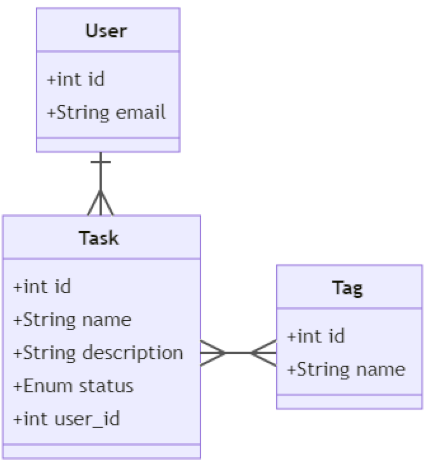

# System Design Document for TODO List Web App

## 1. Overview
  The objective of this project is to develop a user-friendly TODO list web application that empowers users to efficiently manage their tasks. The application will provide core functionalities such as creating, reading, updating, deleting, searching, and filtering tasks within a secure environment.

  For detailed project requirements, please refer to the [Product Requirements Document (PRD)](https://github.com/what-a-cool-team/docs/blob/main/prd/what-a-todo.md).

## 2. Functional Requirements
| Priority | Requirements |
|----------|--------------|
| P0 | Users are able to create an account |
| P0 | Users are able to delete their account |
| P0 | Users are able to log in securely |
| P0 | Users are able create new tasks with a name, and optionally add description and tags |
| P0 | Users are able to update existing tasks to change details such as name, description, status, and tags|
| P1 | Users are able to view a list of all their tasks |
| P2 | Users are able to delete tasks they no longer need |
| P2 | Users are able to search tasks by name or tags |
| P2 | Users are able to filter tasks by status |

## 3. Operational requirements
  * **Security**: 
    * The system should grant users access only to the tasks that they own.
    * The system should allow users to log in and out using their registered ID and password.
    * The system should allow users to delete their accounts.
    * Administrators should be restricted from accessing user passwords.
    
## 4. Domain Model Design

### 4.1 Entities
|Entity| ID example |
|------|--------------|
|User|
|Task|
|Tag|
|Status| "Created", "Committed", "In Progress", "Completed" |


### 4.2 Attributes

| Entity | Question | Logical type | Example value | 
| -------- | ------- | ---------------| ------------- | 
|User| What is the account ID of this user? | string  | "user"| 
|Task| What is the name of this task? | string | "Grocery shopping" | 
|Task| What is the description for this task?" | string | "1. Meat,<br> 2. Onion,"| 
| Task | What is the status of this task? | enum | "In Progress" |
| Tag | What is the name of this tag? | string | "Daily" |

### 4.3 Links
|Entity * Entity| Sentences | Cardinality |
|---------------|-----------|-------------|
|User < Task|User creates many Tasks<br> Task is created by *only one* User|1:N|
|Task = Tag |Task can have *several* tags assigned<br> Tag can be assigned to *several* tasks |M:N |

### Domain Model Diagram


## 5. Tables
 
```sql
CREATE TABLE users (
  id SERIAL PRIMARY KEY,
  account_id VARCHAR(64) NOT NULL
);

CREATE TABLE tasks (
  id SERIAL PRIMARY KEY,
  user_id INT NOT NULL,
  name VARCHAR(128) NOT NULL,
  description VARCHAR(128),
  status VARCHAR(20) NOT NULL CHECK (status IN ('Created', 'Committed', 'In Progress', 'Completed')),
  FOREIGN KEY (user_id) REFERENCES users(id)
);


CREATE TABLE tags (
  id SERIAL PRIMARY KEY,
  name VARCHAR(64) NOT NULL
);

CREATE TABLE tasks_tags (
  task_id INTEGER NOT NULL,
  tag_id INTEGER NOT NULL,
  PRIMARY KEY (task_id, tag_id),
  KEY (tag_id)
  FOREIGN KEY (task_id) REFERENCES tasks(id),
  FOREIGN KEY (tag_id) REFERENCES tags(id)
);
```

## 6. API Document
```yaml
POST /api/users/:
  summary: Creates a new user
  requestBody:
    content:
      application/json:
        schema:
          type: object
          properties:
            id:
              type: string
              description: The account ID for the new user
            password:
              type: string
              description: The password for the new user
          required:
            - account ID
            - password
  responses:
    '201':
      description: User account successfully created
      content:
        application/json:
          schema:
            type: object
            properties:
              success:
                type: boolean
                example: true
    '400':
      description: Bad Request - Invalid input
    '409':
      description: Conflict - Email already exists

DELETE /api/users/{user_id}:
  summary: Deletes a specific user by their ID and all associated tasks
  parameters:
    - name: user_id
      in: path
      required: true
      schema:
        type: integer
      description: The unique identifier of the user to delete
  responses:
    '204':
      description: No Content - User and associated tasks successfully deleted
    '404':
      description: User not found
    '400':
      description: Bad request, possibly due to an invalid user ID

POST /api/tasks:
  summary: Creates a new task for the current user, optionally associating it with description and tags
  requestBody:
    content:
      application/json:
        schema:
          type: object
          properties:
            name:
              type: string
              description: The name of the task
            description:
              type: string
              description: A detailed description of the task
            tags:
              type: array
              description: A list of tag IDs to associate with the task
              items:
                type: integer
          required:
            - name
  responses:
    '201':
      description: Task successfully created
      content:
        application/json:
          schema:
            type: object
            properties:
              id:
                type: integer
                description: The unique identifier of the newly created task
    '400':
      description: Bad Request - Invalid input

GET /api/tasks/:
  summary: Returns a list of all tasks for the current user, optionally filtered by name, tag, or status
  parameters:
    - name: name
      in: query
      required: false
      schema:
        type: string
      description: Filter tasks by name
    - name: tag
      in: query
      required: false
      schema:
        type: string
      description: Filter tasks by tag name
    - name: status
      in: query
      required: false
      schema:
        type: string
      description: Filter tasks by status
  responses:
    '200':
      description: A JSON array of tasks matching the criteria or all tasks if no parameters are provided
      content:
        application/json:
          schema: 
            type: array
            items:
              type: object
              properties:
                id:
                  type: integer
                  description: Unique identifier for the task
                name:
                  type: string
                  description: Name of the task
                description:
                  type: string
                  description: Detailed description of the task
                status:
                  type: string
                  description: Current status of the task (e.g., 'Created', 'Committed', 'In Progress', 'Completed')
                user_id:
                  type: integer
                  description: ID of the user who owns the task

GET /api/tasks/{task_id}:
  summary: Retrieves a specific task by its ID
  parameters:
    - name: task_id
      in: path
      required: true
      schema:
        type: integer
      description: The unique identifier of the task to retrieve
  responses:
    '200':
      description: Task details successfully retrieved
      content:
        application/json:
          schema:
            type: object
            properties:
              id:
                type: integer
                description: The unique identifier of the task
              name:
                type: string
                description: The name of the task
              description:
                type: string
                description: Detailed description of the task
              status:
                type: string
                description: Current status of the task (e.g., 'Created', 'Committed', 'In Progress', 'Completed')
              user_id:
                type: integer
                description: ID of the user who owns the task
    '404':
      description: Task not found
    '400':
      description: Bad request, possibly due to an invalid task ID

PUT /api/tasks/{task_id}:
  summary: Updates an existing task by its ID, allowing modifications to the name, status, description, or tags
  parameters:
    - name: task_id
      in: path
      required: true
      schema:
        type: integer
      description: The unique identifier of the task to update
  requestBody:
    content:
      application/json:
        schema:
          type: object
          properties:
            name:
              type: string
              description: The updated name of the task
            description:
              type: string
              description: The updated description of the task
            status:
              type: string
              description: The updated status of the task (e.g., 'Created', 'Committed', 'In Progress', 'Completed')
            tags:
              type: array
              description: A list of tag IDs to associate with the task (add or remove tags)
              items:
                type: integer
          additionalProperties: false
  responses:
    '200':
      description: Task successfully updated
      content:
        application/json:
          schema:
            type: object
            properties:
              success:
                type: boolean
                example: true
    '204':
      description: No Content - No changes made to the task
    '404':
      description: Task not found
    '400':
      description: Bad request, possibly due to invalid input data or task ID

DELETE /api/tasks/{task_id}:
  summary: Deletes a specific task by its ID
  parameters:
    - name: task_id
      in: path
      required: true
      schema:
        type: integer
      description: The unique identifier of the task to delete
  responses:
    '204':
      description: No Content - Task successfully deleted
    '404':
      description: Task not found
    '400':
      description: Bad request, possibly due to an invalid task ID

POST /api/tags/:
  summary: Creates a new tag
  requestBody:
    content:
      application/json:
        schema:
          type: object
          properties:
            name:
              type: string
              description: The name of the new tag
          required:
            - name
  responses:
    '201':
      description: Tag successfully created
      content:
        application/json:
          schema:
            type: object
            properties:
              id:
                type: integer
                description: The unique identifier of the newly created tag
    '400':
      description: Bad Request - Invalid input
    '409':
      description: Conflict - Tag name already exists

GET /api/tags/:
  summary: Retrieves a list of all tags
  responses:
    '200':
      description: A JSON array of all tags
      content:
        application/json:
          schema:
            type: array
            items:
              type: object
              properties:
                id:
                  type: integer
                  description: The unique identifier of the tag
                name:
                  type: string
                  description: The name of the tag
    '400':
      description: Bad request

GET /api/tags/{tag_id}:
  summary: Retrieves a specific tag by its ID
  parameters:
    - name: tag_id
      in: path
      required: true
      schema:
        type: integer
      description: The unique identifier of the tag to retrieve
  responses:
    '200':
      description: Tag details successfully retrieved
      content:
        application/json:
          schema:
            type: object
            properties:
              name:
                type: string
                description: The name of the tag
    '404':
      description: Tag not found
    '400':
      description: Bad request, possibly due to an invalid tag ID

PUT /api/tags/{tag_id}:
  summary: Updates the name of an existing tag by its ID
  parameters:
    - name: tag_id
      in: path
      required: true
      schema:
        type: integer
      description: The unique identifier of the tag to update
  requestBody:
    content:
      application/json:
        schema:
          type: object
          properties:
            name:
              type: string
              description: The updated name of the tag
          required:
            - name
  responses:
    '200':
      description: Tag successfully updated
      content:
        application/json:
          schema:
            type: object
            properties:
              success:
                type: boolean
                example: true
    '404':
      description: Tag not found
    '400':
      description: Bad request, possibly due to invalid input data or tag ID

DELETE /api/tags/{tag_id}:
  summary: Deletes a specific tag by its ID
  parameters:
    - name: tag_id
      in: path
      required: true
      schema:
        type: integer
      description: The unique identifier of the tag to delete
  responses:
    '204':
      description: No Content - Tag successfully deleted
    '404':
      description: Tag not found
    '400':
      description: Bad request, possibly due to an invalid tag ID

```