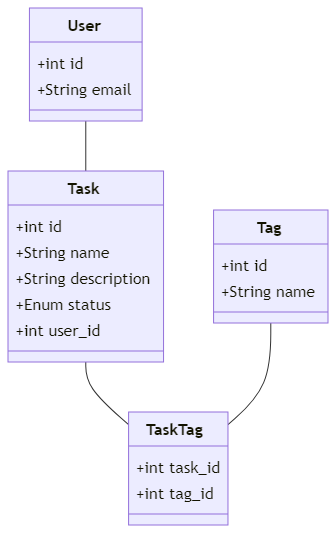

# System Design Document for TODO List Web App

## 1. Overview
  The objective of this project is to develop a user-friendly TODO list web application that empowers users to efficiently manage their tasks. The application will provide core functionalities such as creating, reading, updating, deleting, searching, and filtering tasks within a secure environment.

  For detailed project requirements, please refer to the [Product Requirements Document (PRD)](https://github.com/what-a-cool-team/docs/blob/main/prd/what-a-todo.md).

## 2. Functional Requirements
  * Users must be able to create an account or log in securely.
  * Users can create new tasks with a name, description, and tags.
  * Users can view a list of all thier tasks.
  * Users can update existing tasks to change details such as name, description, status, and tags.
  * Users can delete tasks they no longer need.
  * Users can search tasks by name or tags.
  * Users can filter tasks by status.

## 3. Operational requirements
  * **Scalability**: The application must be capable of scaling efficiently to accommodate increasing numbers of users and tasks.
  * **Reliability**: The application should be designed to minimize downtime and ensure high availability to users.
  * **Security**: 
    - *Authentication and Authorization*: The application must implement robust mechanisms to authenticate users and authorize actions, ensuring that users can only access their own data and functionalities.
    - *Data Protection*: User data should be protected through encryption and other security best practices, both during transmission and while stored.
## 4. Domain Model Design

### 4.1 Entities
|Entity|Physical table|
|------|--------------|
|User|users||
|Task|tasks||
|Tag|tags||


### 4.2 Attributes

| Entity | Question | Logical type | Example value | Physical column | Physical type |
| -------- | ------- | ---------------| ------------- | --------------- | ------------- |
|User| What is the email of this user? | string  | "user@email.com"| users.email | VARCHAR (64)<br> NOT NULL
|Task| What is the name of this task? | string | "Grocery shopping" | tasks.name | VARCHAR (128)<br> NOT NULL
|Task| What is the description for this task?" | string | "1. Meat,<br> 2. Onion,"| tasks.description  | VARCHAR (128)<br> NULL
| Task | What is the status of this task? | enum | "In Progress" | tasks.status | ENUM ('Created', 'On Deck', 'Committed', 'In Progress', 'Completed') <br> NOT NULL |
| Tag | What is the name of this tag? | string | "Daily" | tags.name | VARCHAR (64) <BR> NOT NULL |

### 4.3 Links
|Entity * Entity| Sentences | Cardinality | Physical column|
|---------------|-----------|-------------|----------------|
|User < Task|User creates many Tasks<br> Task is created by *only one* User|1:N| tasks.user_id|
|Task = Tag |Task can have *several* tags assigned<br> Tag can be assigned to *several* tasks |M:N: |task_tags|

### Domain Model Diagram


## 5. Tables
 
```sql
CREATE TABLE users (
  id INTEGER NOT NULL PRIMARY KEY AUTO_INCREMENT,
  email VARCHAR(64) NOT NULL
);

CREATE TABLE tasks (
  id INTEGER NOT NULL PRIMARY KEY AUTO_INCREMENT,
  user_id INTEGER NOT NULL,
  name VARCHAR(128) NOT NULL,
  description VARCHAR(128) NULL,
  status ENUM('Created', 'On Deck', 'Committed', 'In Progress', 'Completed') NOT NULL,
  FOREIGN KEY (user_id) REFERENCES users(id)
);

CREATE TABLE tags (
  id INTEGER NOT NULL PRIMARY KEY AUTO_INCREMENT,
  name VARCHAR(64) NOT NULL
);

CREATE TABLE task_tags (
  task_id INTEGER NOT NULL,
  tag_id INTEGER NOT NULL,
  PRIMARY KEY (task_id, tag_id),
  KEY (tag_id)
  FOREIGN KEY (task_id) REFERENCES tasks(id),
  FOREIGN KEY (tag_id) REFERENCES tags(id)
);
```